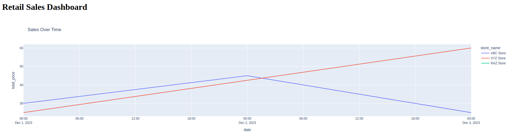

# sales_analytics_ETL_dashboard
This project simulates a real data engineering pipeline of an multi-store retailer. It is fetching sales information from multiple data sources (API, CSV), performing ETL and ELT using Python and SQL, pushing data to a PostgreSQL data warehousing system, and visualizing key business measures through a web dashboard using a dash framework.


## Tech Stack
- **Python** (pandas, requests, SQLAlchemy)
- **PostgreSQL** (for the warehouse)
- **Docker** (to spin up services)
- **Prefect or Airflow** (orchestration)
- **Dash** (for interactive dashboard)
- **dbt (optional)** (ELT modeling)
- **GitHub Actions** (CI/CD)

---

## Folder Structure

```
retail-etl/
├── data/                  # raw/simulated sales data
├── etl/                   # ETL pipeline modules
│   ├── extract.py
│   ├── transform.py
│   ├── load.py
│   └── utils.py
├── dashboard/
│   └── app.py             # Dash dashboard
├── db/
│   ├── schema.sql         # create tables
│   └── init_db.py         # initialize PostgreSQL
├── orchestrator/
│   └── flow.py            # Prefect or Airflow DAG
├── notebooks/
│   └── eda.ipynb          # exploratory analysis
├── docker-compose.yml     # services orchestration
├── requirements.txt
├── README.md
└── .github/
    └── workflows/
        └── ci.yml         # CI/CD pipeline
```

# Setup Instructions

## Clone the repository
git clone git@github.com:RazBiz/sales_analytics_ETL_dashboard.git
cd sales_analytics_ETL_dashboard

## Run the etl flow manually (you can also automate this process as event driven)
export PYTHONPATH=/your/folder/path/sales_analytics_ETL_dashboard
python3 orchestrator/flow.py

## Build and run all services using Docker
docker-compose up --build

## Access the dashboard at:
http://localhost:8050


## Here is a screenshot of the simple dashboard:
